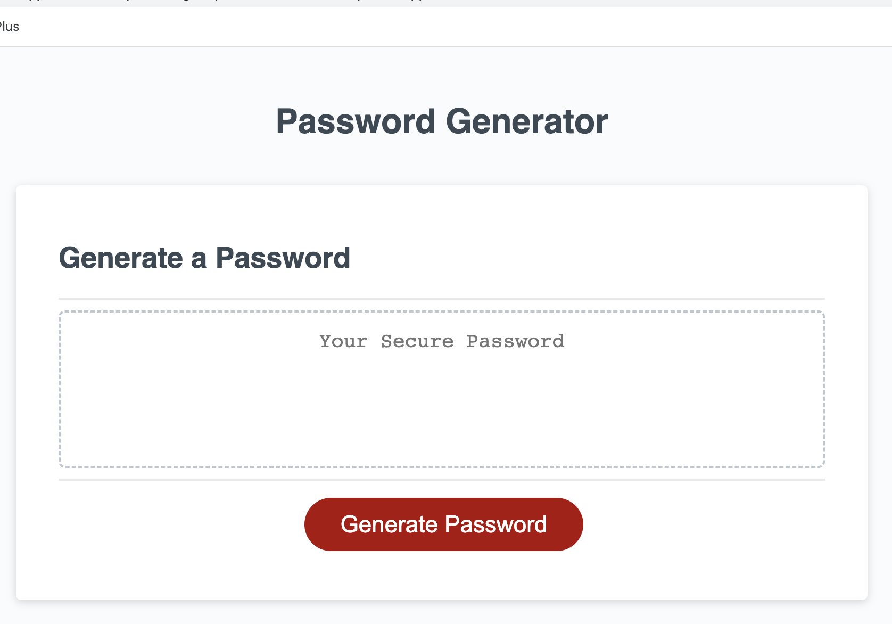
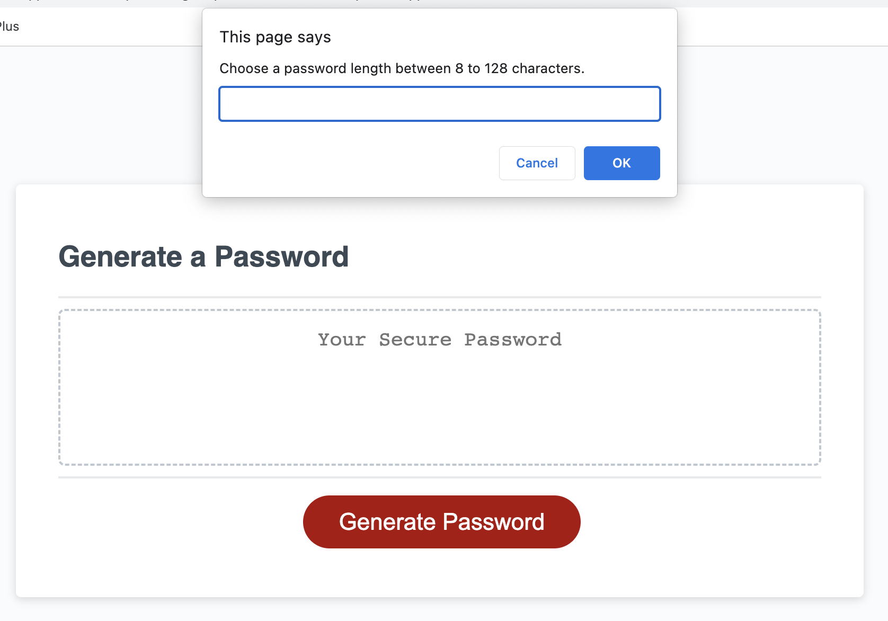
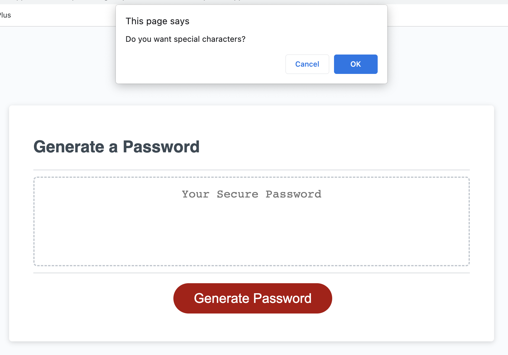
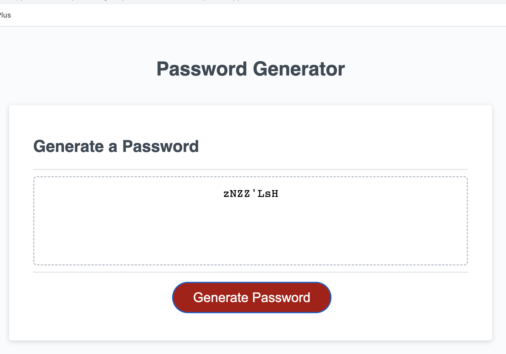

# Password Generator

## Description

This project is to create an application that allows users to generate random passwords based on four criteria. The users can choose to include "special characters", "numbers", "upper-case letters", and "lower-case letters" in the randomized passwords. This application will run in the browser with dynamically updated HTML and CSS powered by JavaScript code. The user interface is responsive to multiple screen sizes.

## Strategies

1. The user will go through a series of prompts for password criteria when clicking the button to generate a password.
2. The user will select which criteria to include in the password.
3. The user will choose a password length between 8 and 128 characters.
4. Password character types will include special characters, numbers, uppercase letters, and lowercase letters for the user to choose from.
5. The user input should be validated and at least one character type should be selected when answering each prompt.
6. A password will be displayed on the page when all prompt are answered.

## Screenshot

Main user interface:

Prompt window to enter password length:

Prompt window to choose password criteria:

Display the randomized password based on the criteria selected:

